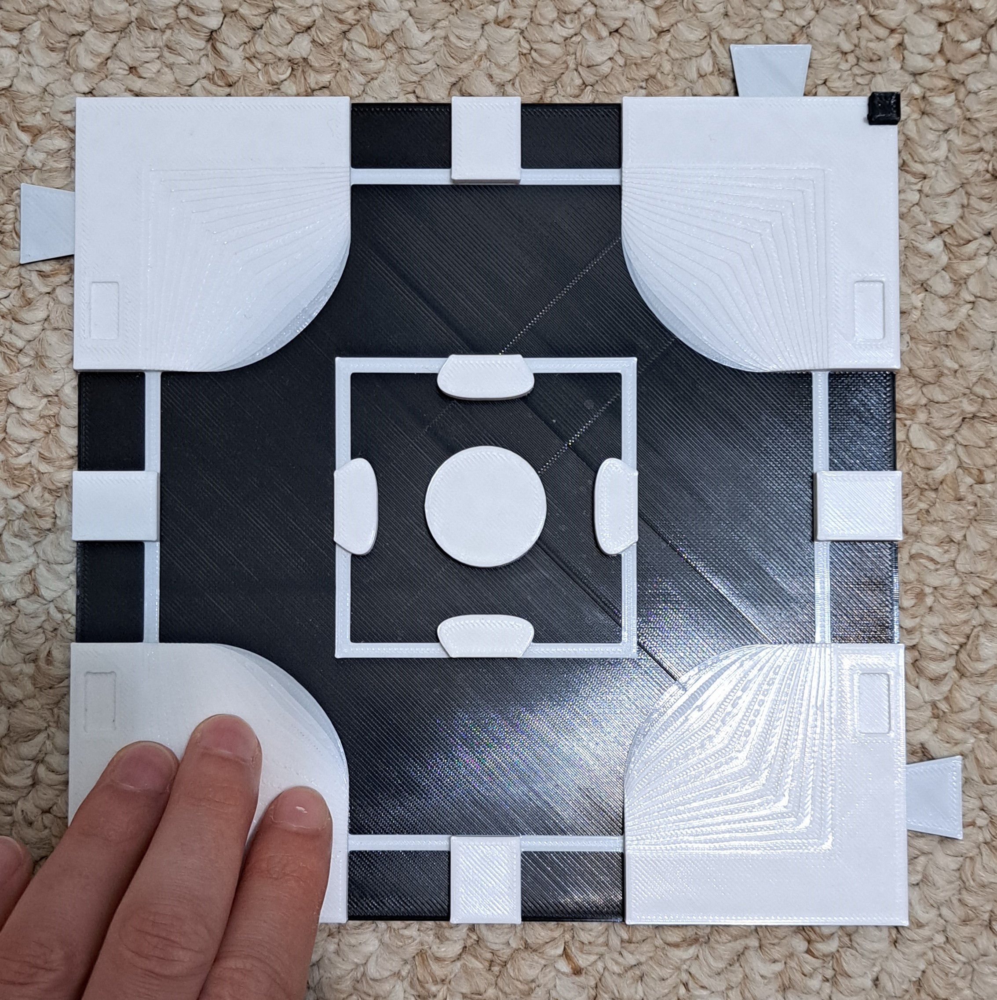

<!--- 
Open Source Assistive Technology: GitHub Readme Template
 --->

<!---
INSTRUCTIONS
This is a markdown template for creating the README.md file in a GitHub repository. This file is rendered and displayed automatically when someone visits the repository.

This document includes helper text that will not be displayed when rendered. Any text between the less-than sign + exclamation mark + three hyphen-minus (<!---) and matching three hyphen-minus + greater-than sign will not be displayed. This helper text can be deleted once the corresponding section is completed.

 --->
 
 <!--- 
TITLE
Should match the name of the GitHub repository. Choose something descriptive rather than whimsical. 
 --->
 # Tactile Maps

<!--- 
SUMMARY
A brief summary of the project. What it does, who it is for, how much it costs.
 --->
The Tactile Maps are designed to help users with visual impairments learn to navigate different types of intersections with various traffic signs and signals. Maps can be used separately as a learning tool for specific intersections and traffic signs and signals, or can be connected together to plan routes between locations.
The legend includes Braille labels for the different representations of traffic signs and signals.

<!--- 
PHOTO

 --->

<!--- 
## More info at
 - [Makers Making Change Forum Thread](TBD) 
 - [Makers Making Change Project Page](https://makersmakingchange.com/project/tactile-maps/)
 --->

## Getting Started
<!--- 
Include an overall idea of what major steps are required to build the device.
 --->

### 1. Order the Off-The-Shelf Components
The [Bill of Materials](/Documentation/Tactile_Maps_BOM_v1.0.xlsx) lists all of the parts and components required to build the Tactile Maps.

### 2. Print the 3D Printable components
Print the components requested by the user.

All of the files and individual print files can be in the [/Build_Files/3D_Printing_Files](/Build_Files/3D_Printing_Files/) folder.

### 3. Assemble the Tactile Maps.
Reference the [Assembly Guide](/Documentation/Tactile_Maps_Maker_Guide_v1.0.pdf) for the tools and steps required to build the maps.

## Files
<!---
FILES
This section includes all the information and files required to build and modify the device, including documentation, design files, and build files. 
--->

### Documentation
<!---
DOCUMENTATION

--->
| Document | Version | Link |
|----------|---------|------|
| Design Rationale     | 1.0 | [Tactile_Maps_Design_Rationale](/Documentation/Tactile_Maps_Design_Rationale_v0.1.pdf) |
| Bill of Materials    | 1.0 | [Tactile_Maps_BOM](/Documentation/Tactile_Maps_BOM_v0.1.xlsx) |
| Maker Guide       | 1.0 | [Tactile_Maps_Instructions](/Documentation/Tactile_Maps_Maker_Guide_v0.1.pdf) |
| User Guide          | 1.0 | [Tactile_Maps_User_Guide](/Documentation/Tactile_Maps_User_Guide_v1.0.pdf)           |
| Changelog            | 1.0 | [Tactile_Maps_Changelog](/Documentation/Tactile_Maps_Changelog_v0.1.pdf)               |

### Design Files
<!---
DESIGN FILES
If possible, include a copy of original design files to facilitate easy editing and customization.
--->
 - [CAD Files](/Design_Files/CAD)

### Build Files
<!---
BUILD FILES
This section i
--->
 - [3D Printing Files](/Build_Files/3D_Printing)

## License
<!---
LICENSE
Choose an appropriate license. We recommend an open-source hardware compatible license.
--->
Everything needed or used to design, make, test, or prepare the Tactile Maps is licensed under the CERN 2.0 2.0 Permissive license <https://ohwr.org/project/cernohl/wikis/Documents/CERN-OHL-version-2> (CERN-OHL-P).

Accompanying material such as instruction manuals, videos, and other copyrightable works that are useful but not necessary to design, make, test, or prepare the Tactile Maps are published under a Creative Commons Attribution-ShareAlike 4.0 license <https://creativecommons.org/licenses/by-sa/4.0/> (CC BY-SA 4.0).

## Attribution
<!---
ATTRIBUTION
Include any information related to the development of the design. This may include who identified the initial challenge, who contributed to the design
--->

The documentation template was created by Makers Making Change and is used under a CC BY-SA 4.0 license. It is available at the following link: https://github.com/makersmakingchange/OpenAT-Template

## About Makers Making Change

Makers Making Change is an initiative of [Neil Squire](https://www.neilsquire.ca/), a Canadian non-profit that uses technology, knowledge, and passion to empower people with disabilities.

We are committed to cultivating a network of volunteer makers who support people with disabilities in their communities through cost effective assistive technology. Check out our library of free, open-source assistive technologies.

 - Website: [www.MakersMakingChange.com](https://www.makersmakingchange.com/)
 - [GitHub](https://github.com/makersmakingchange)
 - [Thingiverse](https://www.thingiverse.com/makersmakingchange/about)
 - Twitter: [@makermakechange](https://twitter.com/makermakechange)
 - Instagram: [@makersmakingchange](https://www.instagram.com/makersmakingchange)

### Contact Us
For technical questions, to get involved, or to share your experience we encourage you to visit [MMC Forum](https://forum.makersmakingchange.com) or contact info@makersmakingchange.com
